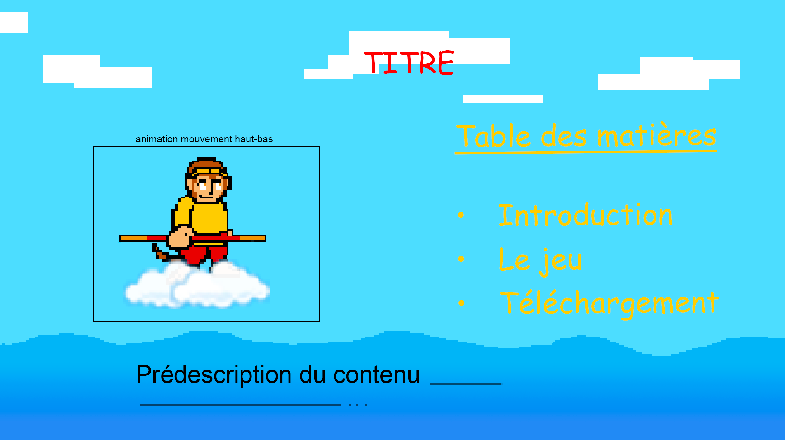
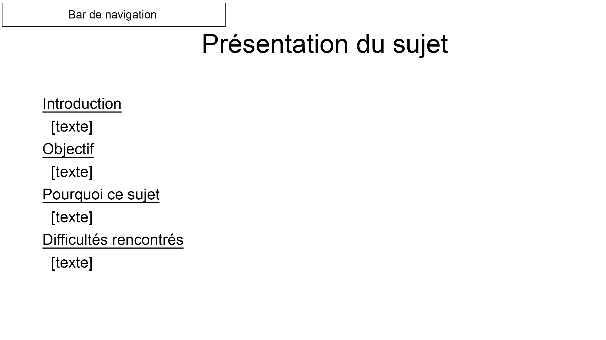
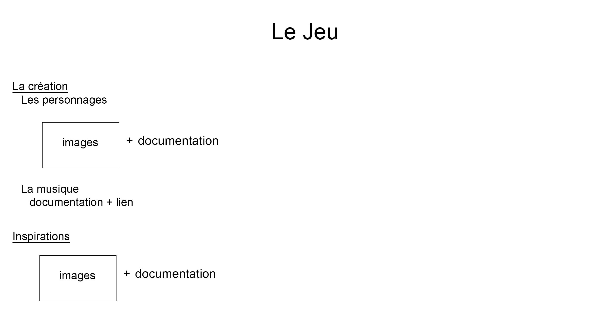

# Projet d'informatique
## Introduction
Dans ce projet d'informatique, sur la création d'un site web,
# Cahier des charges
## Sujet
Le sujet traité sera le mythe de Sun Wukong.
## Contenu et style
Le site web comporte quatre pages : une page d’accueil, une introduction, une page dédiée au jeu et une dernière page pour le téléchargement.

Sur la page d’accueil figurent le titre du site ainsi qu’une table des matières présentant les trois sections principales. En dessous se trouve une brève description générale du contenu du site.

La deuxième page est entièrement consacrée à la présentation du sujet. On y trouve l’introduction, les objectifs du projet, le choix du thème ainsi que les difficultés rencontrées.

La troisième page est entièrement dédiée au jeu. J’y présente d’abord la création des personnages, accompagnée d’images illustratives. J’y décris également la conception musicale et les différentes sources d’inspiration.

Enfin, la dernière page permet de télécharger le jeu Wukong’s Legend sur macOS, Windows et Linux.
## Maquette

#### Page d'aqueil

#### Présentation du sujet

#### Présentation du jeu

#### Téléchargement du jeu
