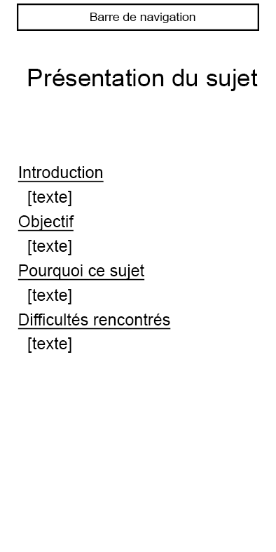
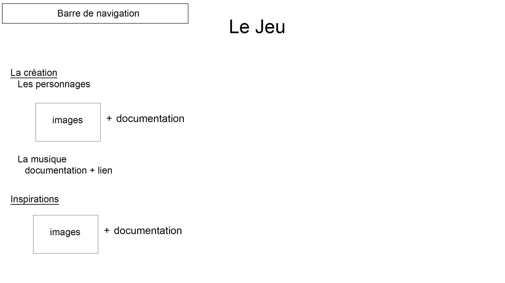
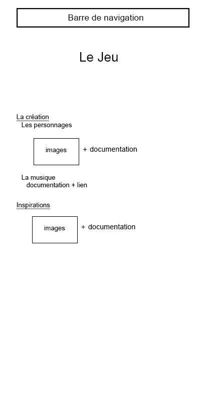
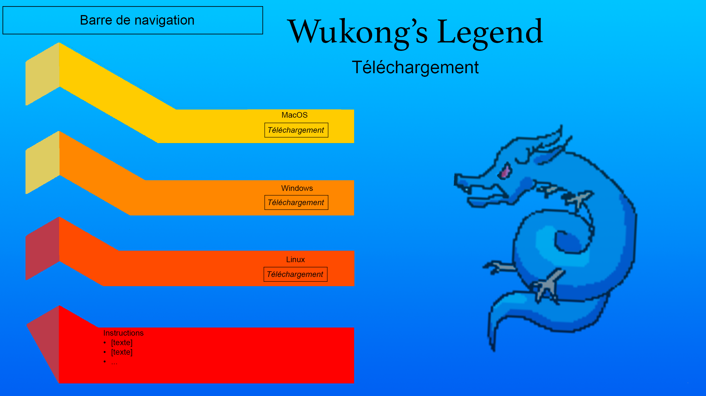

# <u>Projet d'informatique</u>

## Introduction

Dans ce projet d'informatique, sur la création d'un site web,

## Cahier des charges

### Sujet

Le site Web est créé por tprésentation et téléchargement du jeu.
Le personnage principal de ce travail est Sun Wukong, un singe espiègle, également connu sous le nom de Roi des Singes. Ce personnage légendaire est une figure emblématique de la mythologie chinoise, incarnant à la fois la puissance, l'intelligence, la malice et la rébellion. Il apparaît pour la première fois sous forme littéraire dans le roman classique chinois La Pérégrination vers l’Ouest, écrit au XVIème siècle par Wu Cheng’en. Cette œuvre est considérée comme l’un des quatre grands romans classiques de la littérature chinoise.  
Dans l’œuvre de Wu Cheng’en, Sun Wukong naît d’un rocher magique fécondé par les souffles célestes, sur la Montagne des Fleurs et des Fruits. Il acquiert très tôt une force surnaturelle, une grande vivacité d'esprit et des pouvoirs extraordinaires. Il apprit notamment la maitrise des 72 transformations magiques, la capacité de voler sur les nuages, et l’usage du bâton magique Jingu Bang, capable de changer de taille à volonté. Ce dernier est pris du Roi Dragon des mers de l’Est sans son accord.  
Le récit de La Pérégrination vers l’Ouest est à la fois une aventure fantastique et une allégorie bouddhiste et taoïste. Après avoir semé le chaos au paradis et défié les cieux, est puni par le Bouddha, qui l’enferme sous une montagne pendant 500 ans. Il sera par la suite le premier des trois disciples du moine bouddhiste Tang Sanzang l’accompagnant dans son voyage vers l’Inde, afin de récupérer des textes sacrés. Ce périple symbolise la quête de la sagesse et la transformation intérieure.  
Le mythe de Sun Wukong est une aventure épique, pleine de combats et d’humour. Mais plus profondément, on peut le voir comme un récit initiatique. Sun Wukong commence comme un être orgueilleux et indiscipliné, et devient peu à peu un disciple loyal et protecteur, apprenant la discipline, la compassion et la spiritualité.

### Contenu et style

Le site web comporte quatre pages : une page d’accueil, une introduction, une page dédiée au jeu et une dernière page pour le téléchargement.  
Sur la page d’accueil figurent le titre du site ainsi qu’une table des matières présentant les trois sections principales. En dessous se trouve une brève description générale du contenu du site.  
La deuxième page est entièrement consacrée à la présentation du sujet. On y trouve l’introduction, les objectifs du projet, le choix du thème ainsi que les difficultés rencontrées.  
La troisième page est entièrement dédiée au jeu. J’y présente d’abord la création des personnages, accompagnée d’images illustratives. J’y décris également la conception musicale et les différentes sources d’inspiration.  
Enfin, la dernière page permet de télécharger le jeu Wukong’s Legend sur macOS, Windows et Linux......

Le style général de la maquette s’inspire du rétro pixel art des jeux vidéo classiques, contenant du graphisme pixelisé et simple tel qu’est représenté Sun Wukong, le personnage principal, ainsi que des éléments emblématiques comme le roi dragon et les nuages.  
Les pages d’accueil et de téléchargement utilisent une palette dominée par le bleu aquatique pour l’eau et le cyan pour le ciel le tout symbolisant la nature. À l’inverse, les couleurs chaudes comme le jaune et le rouge mettent en valeur l’énergie et le caractère de Sun Wukong.  
La page de présentation du sujet prend un style plus sobre et entièrement textuel, sans éléments graphiques afin de mettre l’accent sur le contenu explicatif.  
L’ensemble de la maquette est conçu de manière cohérente, conservant une identité visuelle fidèle à l’univers du jeu.

### pts obligatoires

### Maquette

#### Page d'aqueil

#### Présentation du sujet

#### Présentation du jeu

#### Téléchargement du jeu

